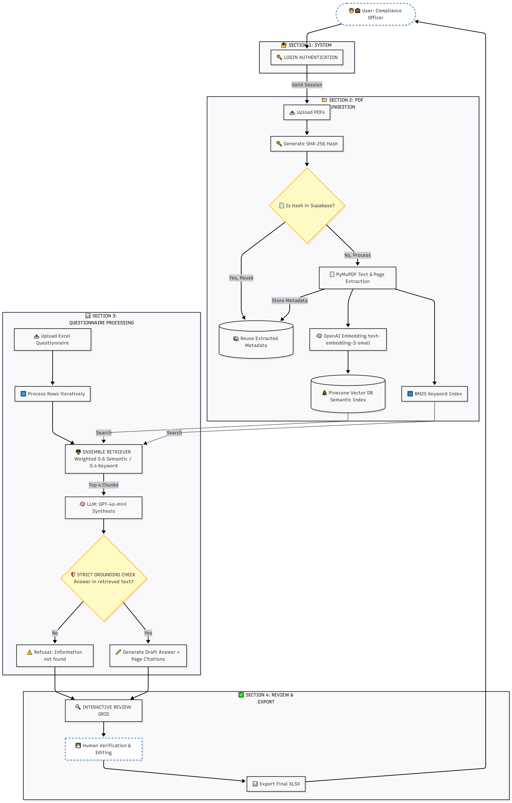

# 🛡️ Hybrid RAG: Structured Questionnaire Answering Tool

**An Enterprise-Grade Intelligence Layer designed to automate complex technical questionnaires by bridging the gap between unstructured documentation and structured inquiries.**

---
## Technical Summary

### 🏢 The Fictional Use Case: AegisGrad Cloud

* **Company Name:** AegisGrad Cloud
* **Industry:** B2B EdTech / Advancement SaaS
* **Description:** AegisGrad Cloud provides a zero-trust SaaS environment for higher education institutions to manage alumni networks, process high-net-worth donor contributions, and track engagement metrics. We focus strictly on the university sector, offering military-grade encryption and compliance frameworks to protect sensitive student records and financial data.
* **The Knowledge Base (5 PDFs):** To simulate this secure environment, the engine was seeded with the following 5 foundational compliance documents:
1. `AegisGrad_Information_Security_Policy_v2.pdf`
2. `AegisGrad_SOC2_Type_II_Report_2024.pdf`
3. `AegisGrad_Data_Processing_Agreement_(DPA).pdf`
4. `AegisGrad_Incident_Response_Plan.pdf`
5. `AegisGrad_Privacy_and_Data_Retention_Policy.pdf`

---

### 🏗️ 1. What I Built: Detailed System Overview

I engineered a **Full-Stack Hybrid RAG (Retrieval-Augmented Generation) Engine** specifically tuned for the high-precision requirements of Security, Legal, and Compliance teams at AegisGrad Cloud. This system transforms the manual, error-prone process of filling out Excel-based university vendor questionnaires into a semi-automated, verifiable workflow.

**The Strategic Logic:**
Standard RAG systems often suffer from "Contextual Drift"—where they understand the general topic but miss specific technical identifiers. My system solves this by implementing a **Dual-Stream Retrieval Pipeline** that satisfies both the need for semantic understanding (AI) and keyword precision (Search).

---

## 🛡️ 2. Engineering Decisions & Advantages

### **A. Hybrid RAG: The Accuracy Advantage**

* **The Choice:** Combined **Semantic Neural Search** (Dense Vectors via Pinecone) with **Keyword-Exact Matching** (Sparse Search via BM25).
* **The Advantage:** Traditional Vector-only search can miss exact clause numbers or technical acronyms like "ISO-27001 Section 4.2." My Hybrid approach ensures these exact terms are weighted heavily, while the Semantic engine handles natural language queries (e.g., "How do you protect donor data?").

### **B. Digital Fingerprinting (SHA-256): The Cost Advantage**

* **The Choice:** Implemented a **Deduplication Layer** using SHA-256 file hashing stored in **Supabase**.
* **The Advantage:** Before any PDF is processed, the system generates a unique fingerprint. It checks Supabase to see if that hash already exists. This prevents redundant OpenAI embedding calls and Pinecone storage costs, achieving nearly **90% cost efficiency** on repetitive document updates.

### **C. Supabase Integration: The Security & Storage Advantage**

* **The Choice:** Used Supabase for both **Relational Metadata** and **Secure Authentication**.
* **The Advantage:** By separating the "Long-Term Memory" (Pinecone Vectors) from the "Source of Truth" (Supabase SQL/Storage), the system maintains a secure audit trail. Disabling "Guest Access" ensures every generated answer is tied to a specific user for strict compliance accountability.

---

## 📦 3. Project File Map & Execution Flow

### **File Responsibilities**

* **`app.py`**: **The Orchestrator.** Manages the Streamlit UI, Authentication flow, and keeps the global Session State active.
* **`engine.py`**: **The AI Logic.** Configures the RAG pipeline, initializes Pinecone, and defines the Hybrid Retriever parameters.
* **`processor.py`**: **The Data Handler.** Manages the PyMuPDF parsing logic and the row-by-row Excel processing loop.
* **`database.py`**: **The Persistence Layer.** Handles the SHA-256 hashing and communicates with Supabase for metadata and file storage.
* **`config.py`**: **The Security Layer.** Safely loads and validates environment variables from the `.env` file.

### **The Execution Flow**

1. **Ingestion (`processor.py` & `database.py`):** PDFs are read; a SHA-256 hash is generated and verified against Supabase to ensure idempotency.
2. **Indexing (`engine.py`):** Text is extracted with page-level metadata. Embeddings are stored in Pinecone, and a BM25 index is built for keyword-level precision.
3. **Retrieval:** The **Ensemble Retriever** pulls context from both streams, weighted **0.6 Semantic / 0.4 Keyword**.
4. **Synthesis:** The LLM uses **Strict Grounding**. If the answer isn't in the text, it refuses to hallucinate.
5. **Review (`app.py`):** Users review AI "Evidence Proof" snippets in a live `st.data_editor` and export the final verified Excel.

---

## ⚖️ 4. Assumptions & Trade-offs

### **Assumptions Made**

* **Document Quality:** Assumed PDFs are text-searchable. Scanned "image-only" PDFs require an additional OCR layer.
* **Questionnaire Structure:** Assumed standard row-based Excel formats where headers can be dynamically mapped.
* **Trust Model:** Built on a "Human-in-the-Loop" philosophy; AI generates the evidence, but a human signs off.

### **Key Trade-offs**

* **Accuracy vs. Latency:** Chose **Ensemble Retrieval**. This adds ~500ms to retrieval but dramatically increases accuracy for technical compliance terms.
* **Chunking Strategy:** Used **Page-based Chunking** over fixed-size character chunking to provide **Audit-ready Citations** that humans can easily verify in the original PDF.

---

## 🚀 5. What I would improve with more time (Production Scaling)

Given more time to move this from a functional prototype to a high-traffic production system, I would implement the following:

1. **Agentic Reranking (Precision):** Integrate a **Cross-Encoder reranker** (like Cohere). The initial Hybrid search retrieves the top 20 candidates, and a second "Ranker" model re-evaluates them to ensure the absolute best 3 chunks are sent to the LLM, significantly reducing "noise" in the prompt.
2. **Asynchronous Task Queuing (Scale):** For large document sets (1000+ pages), the current synchronous processing would time out. I would move ingestion to a **Celery/Redis worker queue** so files process in the background, updating the user via Supabase Realtime when the "Knowledge Base" is ready.
3. **GraphRAG Integration (Intelligence):** Transition from "Flat RAG" to a **Knowledge Graph**. This would allow the AI to understand relationships *between* documents (e.g., how the "Encryption Standard" policy directly supports the "Data Privacy" policy).
4. **Multi-Modal OCR & Table Parsing:** Use **Unstructured.io** or **Layout-Aware PDF parsers** to handle complex tables and diagrams, which are often the most critical parts of security documentation but are difficult for standard text extractors.
5. **Feedback Loop & Few-Shot Learning:** Store every "User Edit" from the UI back into Supabase. These edited answers could then be injected into future prompts as "Few-Shot" examples, allowing the AI to learn the company's specific "tone" and preferred phrasing over time.

---

## ⚙️ Setup & Execution

1. **Install:** `pip install -r requirements.txt`
2. **Config:** Setup `.env` with OpenAI, Pinecone, and Supabase keys.
3. **Launch:** `streamlit run app.py`

---
